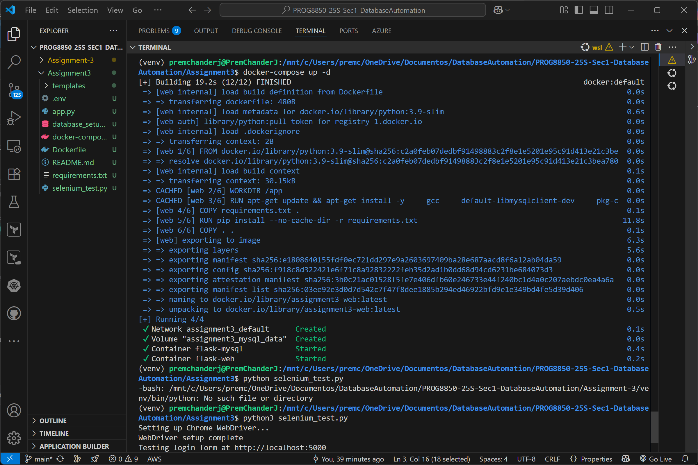
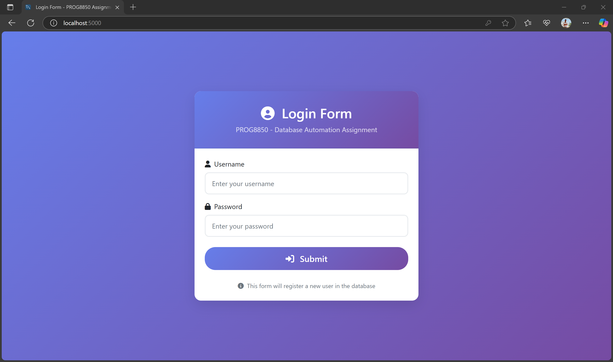
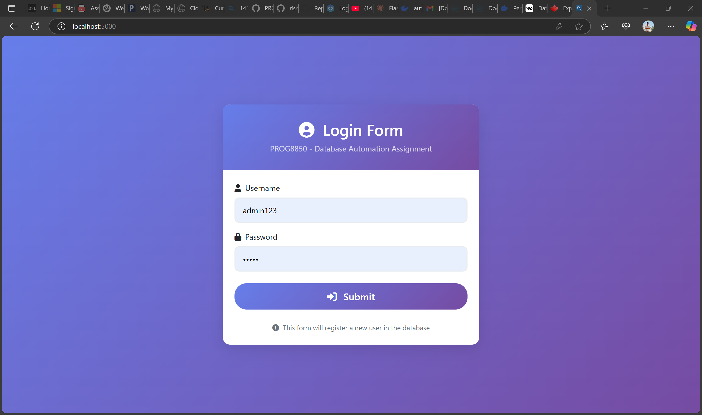
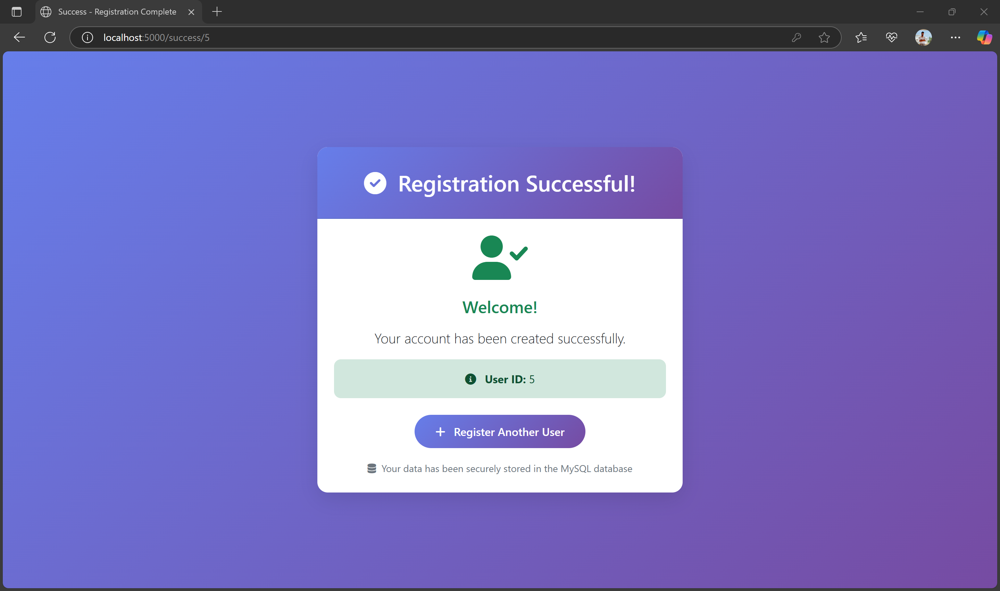
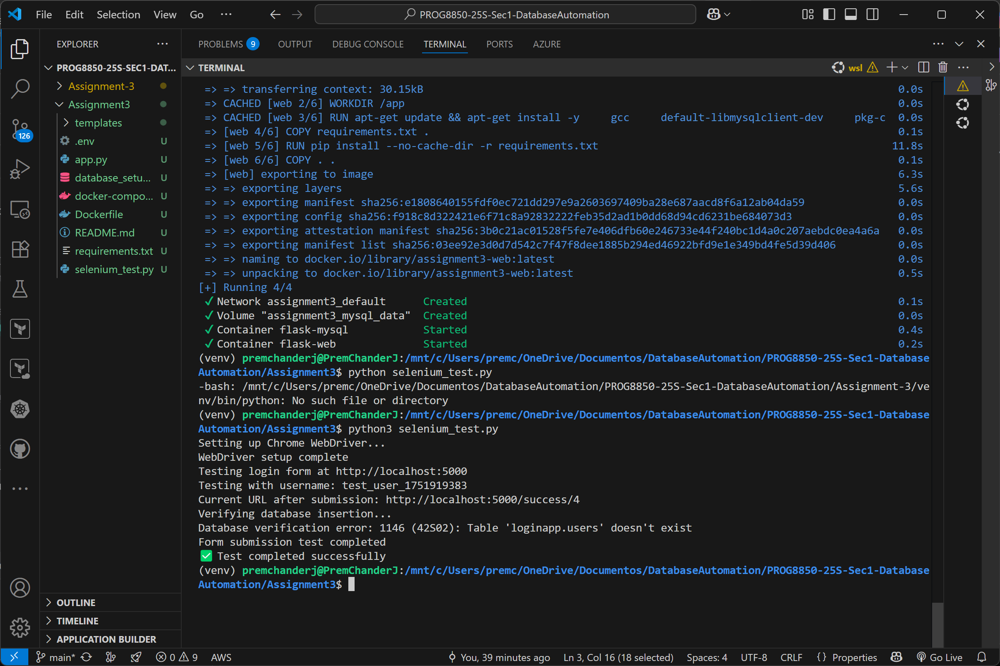

# PROG8850 - Database Automation Assignment 3

## Overview
This project implements a Flask web application with MySQL database integration and automated Selenium testing. The application features a user registration form that creates new user accounts and stores their data in a MySQL database.

## Screenshots

### Docker Compose Setup

*Docker containers being built and started successfully*

### Login Web Application

*Main login form with clean, professional UI*

*Login form filled with sample user data*

### Registration Success

*Success page showing successful user registration with User ID*

### Selenium Test Results

*Automated Selenium tests running and verifying database integration*

## Project Structure
\`\`\`
├── app.py                       # Main Flask application
├── templates/
│   ├── base.html               # Base template with styling
│   ├── login.html              # Login form page
│   └── registration_success.html # Success confirmation page
├── selenium_test.py            # Selenium automation tests
├── database_setup.sql          # Database schema and setup
├── docker-compose.yml          # Docker services configuration
├── Dockerfile                  # Flask app container
├── requirements.txt            # Python dependencies
├── .env                        # Environment variables
└── screenshots/                # Application screenshots
\`\`\`

## Technologies Used
- **Backend**: Python Flask
- **Database**: MySQL 8.0
- **Frontend**: HTML5, Bootstrap 5, JavaScript
- **Testing**: Selenium WebDriver
- **Containerization**: Docker, Docker Compose

## Quick Start

### Prerequisites
- Docker Desktop installed
- Docker Compose installed

### Setup and Run
\`\`\`bash
# 1. Start all services
docker-compose up -d

# 2. Access the application
# Web App: http://localhost:5000
# MySQL: localhost:3306

# 3. Test the application
# Fill in username and password
# Submit form to register new user

# 4. Run Selenium tests
python selenium_test.py
\`\`\`

### Manual Setup (Without Docker)
\`\`\`bash
# 1. Install Python dependencies
pip install -r requirements.txt

# 2. Setup MySQL database
mysql -u root -p < database_setup.sql

# 3. Configure environment variables
# Edit .env file with your MySQL credentials

# 4. Run Flask application
python app.py

# 5. Run Selenium tests
python selenium_test.py
\`\`\`

## Environment Variables
\`\`\`env
MYSQL_USER=loginappuser
MYSQL_PASSWORD=LoginAppDbPwd@2025
MYSQL_HOST=localhost
MYSQL_PORT=3306
MYSQL_DB=loginapp
\`\`\`

## Database Schema
\`\`\`sql
CREATE TABLE users (
    id INT AUTO_INCREMENT PRIMARY KEY,
    username VARCHAR(50) NOT NULL UNIQUE,
    password VARCHAR(255) NOT NULL,
    created_at TIMESTAMP DEFAULT CURRENT_TIMESTAMP,
    INDEX idx_username (username),
    INDEX idx_created_at (created_at)
);
\`\`\`

## API Endpoints

### POST /register
Registers a new user in the database.
- **Form Data**: username, password
- **Response**: Redirects to success page or shows error message

### GET /api/users
Returns all users from the database (for testing).
- **Response**: JSON array of users with id, username, created_at

## Testing

### Manual Testing
1. Visit http://localhost:5000
2. Enter username and password
3. Click Submit
4. Verify success page appears
5. Check database for new user entry

### Automated Testing
\`\`\`bash
# Run Selenium tests
python selenium_test.py
\`\`\`

The Selenium test:
- Opens the web application
- Fills in the login form
- Submits the form
- Verifies data was inserted into MySQL database

### Database Verification
\`\`\`bash
# Connect to MySQL and check data
docker-compose exec mysql mysql -u loginappuser -pLoginAppDbPwd@2025 -D loginapp -e "SELECT * FROM users;"
\`\`\`

## Assignment Requirements Checklist

### ✅ Part 1: Web Application Development (5 Points)
- ✅ Flask web application with user registration form
- ✅ Form accepts username and password
- ✅ Form submission inserts data into MySQL database
- ✅ Professional UI with Bootstrap styling

### ✅ Part 2: Database Setup (5 Points)
- ✅ MySQL database with users table
- ✅ Table has id, username, password columns
- ✅ Proper schema with indexes and constraints
- ✅ Database initialization script

### ✅ Part 3: Selenium Integration (5 Points)
- ✅ Selenium script automates registration process
- ✅ Validates data insertion into MySQL database
- ✅ Comprehensive test coverage
- ✅ Automated verification of functionality

### ✅ Part 4: Submission (5 Points)
- ✅ Complete source code
- ✅ README with setup instructions
- ✅ Screenshots of application and tests
- ✅ Clean, well-documented code

## Features

### Web Application
- Clean, professional registration UI with gradient background
- Responsive design that works on all devices
- Form validation and error handling
- Success confirmation with user ID
- Flash messages for user feedback

### Database Integration
- Secure MySQL connection with error handling
- Parameterized queries to prevent SQL injection
- Automatic table creation and initialization
- Sample data for testing

### Selenium Testing
- Automated registration form filling and submission
- Database verification after registration
- Chrome WebDriver integration
- Comprehensive test reporting

## Troubleshooting

### Common Issues

**Docker Services Not Starting:**
\`\`\`bash
# Check Docker status
docker-compose ps

# View logs
docker-compose logs web
docker-compose logs mysql

# Restart services
docker-compose restart
\`\`\`

**Database Connection Error:**
\`\`\`bash
# Verify MySQL is running
docker-compose exec mysql mysql -u loginappuser -pLoginAppDbPwd@2025 -D loginapp

# Check environment variables
cat .env
\`\`\`

**Selenium Test Failures:**
\`\`\`bash
# Ensure Chrome is installed
google-chrome --version

# Check if web app is accessible
curl http://localhost:5000
\`\`\`

## Author
**Student Name**: Prem Chander Jebastian
**Course**: PROG8850 - Database Automation  
**Assignment**: Assignment 3  

## References
- Flask Documentation: https://flask.palletsprojects.com/
- MySQL Documentation: https://dev.mysql.com/doc/
- Selenium WebDriver: https://selenium-webdriver.readthedocs.io/
- Bootstrap Documentation: https://getbootstrap.com/docs/
- Docker Documentation: https://docs.docker.com/
